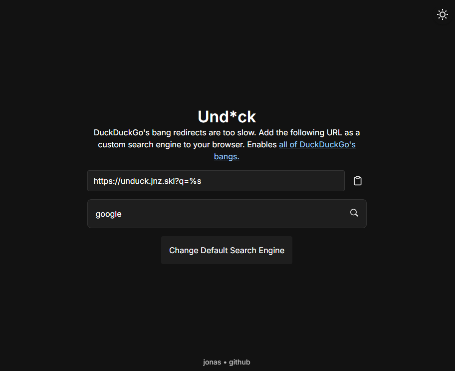

# Unduck



DuckDuckGo's bang redirects are too slow. Add the following URL as a custom search engine to your browser. Enables all of DuckDuckGo's bangs to work, but much faster.

```
https://unduck.jnz.ski?q=%s
```

## How is it that much faster?

Forked from https://github.com/t3dotgg/unduck. 
With the following changes:
- Redirect to homepage when the query is empty (https://github.com/ronanru/unduck)
- Darkmode (https://github.com/luinbytes/unduck)
- OpenSearch Metadata (https://github.com/samiindeed/unduck)
- Reverse bang detection, i.e. detect both `!g` and `g!` (https://github.com/mujtabachang/unduck/tree/fix-reverse-bang)
- Default search engine search menu
- Added a search bar to test the search engine

DuckDuckGo does their redirects server side. Their DNS is...not always great. Result is that it often takes ages.

Theo solved this by doing all of the work client side. Once you've went to https://unduck.jnz.ski once, the JS is all cache'd and will never need to be downloaded again. Your device does the redirects, not me.
